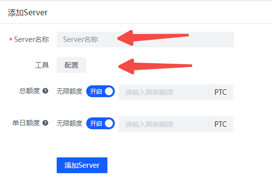
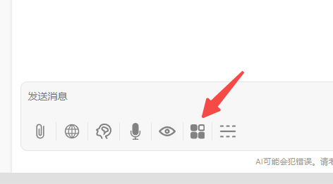
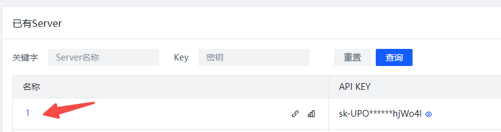

# <p align="center">🤖 302AI Custom MCP Server🚀✨</p>

<p align="center">A customizable MCP service that supports tool selection and flexible configuration to meet your various needs.</p>

<p align="center"><a href="https://www.npmjs.com/package/@302ai/custom-mcp" target="blank"></a></p >

<p align="center"><a href="README_zh.md">中文</a> | <a href="README.md">English</a> | <a href="README_ja.md">日本語</a></p>

 

## Tutorial
Open MCP Server in the menu   
     

Enter a name and select the tools you want to configure.   


This is the current list of available tools, which is continuously being updated   


After creation, click on the Server name to view the Server configuration   


Different Servers use different KEYs to obtain tool configurations. The client only needs to be installed once, no repeated installation required. Switching between different Servers only requires changing the API_KEY.    


Open the MCP Server button in the chatbot   


Enter the key you just created in 302ai-custom-server    


Turn on the Server switch to start using it.  

Taking Chatwise as an example for use in third-party clients
Click on the Server name, then click the copy button    



Open Chatwise settings-tools, click the bottom left corner, import JSON from clipboard   


MCP Server imported successfully, you can now use it normally.

## ✨ Features ✨
- 🔧 Quickly generate your own MCP Server by selecting different APIs
- 🌐 Compatible with: Various MCP-supported clients, including 302.AI's chatbot
- 💻 Currently includes multiple tool types such as BrowserUseTools, FileTools, ImageTools, MathTools, SandboxTools, with more updates coming


## Development

Install dependencies:

```bash
npm install
```

Build the server:

```bash
npm run build
```

For development with auto-rebuild:

```bash
npm run watch
```

## Installation

To use with Claude Desktop, add the server config:

On MacOS: `~/Library/Application Support/Claude/claude_desktop_config.json`
On Windows: `%APPDATA%/Claude/claude_desktop_config.json`

```json
{
  "mcpServers": {
    "302ai-custom-mcp": {
      "command": "npx",
      "args": ["-y", "@302ai/custom-mcp"],
      "env": {
        "302AI_API_KEY": "YOUR_API_KEY_HERE"
      }
    }
  }
}
```

To use with Cherry Studio, add the server config:

```json
{
  "mcpServers": {
    "Li2ZXXJkvhAALyKOFeO4N": {
      "name": "302ai-custom-mcp",
      "description": "",
      "isActive": true,
      "registryUrl": "",
      "command": "npx",
      "args": [
        "-y",
        "@302ai/custom-mcp"
      ],
      "env": {
        "302AI_API_KEY": "YOUR_API_KEY_HERE"
      }
    }
  }
}
```

To use with ChatWise, copy the following content to clipboard
```json
{
  "mcpServers": {
    "302ai-custom-mcp": {
      "command": "npx",
      "args": ["-y", "@302ai/custom-mcp"],
      "env": {
        "302AI_API_KEY": "YOUR_API_KEY_HERE"
      }
    }
  }
}
```
Go to Settings -> Tools -> Add button -> Select Import from Clipboard


### Find Your 302AI_API_KEY [here](https://dash.302.ai/apis/mcp-server)
[Using Tutorials](https://help.302.ai/docs/MCP-Server-de-shi-yong)

### Debugging

Since MCP servers communicate over stdio, debugging can be challenging. We recommend using the [MCP Inspector](https://github.com/modelcontextprotocol/inspector), which is available as a package script:

```bash
npm run inspector
```

The Inspector will provide a URL to access debugging tools in your browser.


## ✨ About 302.AI ✨
[302.AI](https://302.ai/en/) is an enterprise-oriented AI application platform that offers pay-as-you-go services, ready-to-use solutions, and an open-source ecosystem.✨
1. 🧠 Integrates the latest and most comprehensive AI capabilities and brands, including but not limited to language models, image models, voice models, and video models.
2. 🚀 Develops deep applications based on foundation models - we develop real AI products, not just simple chatbots
3. 💰 Zero monthly fee, all features are pay-per-use, fully open, achieving truly low barriers with high potential.
4. 🛠 Powerful management backend for teams and SMEs - one person manages, many people use.
5. 🔗 All AI capabilities provide API access, all tools are open source and customizable (in progress).
6. 💡 Strong development team, launching 2-3 new applications weekly, products updated daily. Developers interested in joining are welcome to contact us.