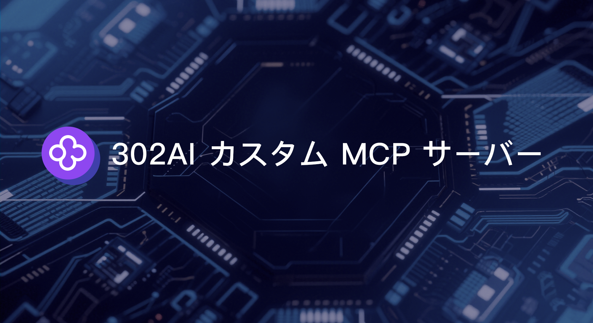
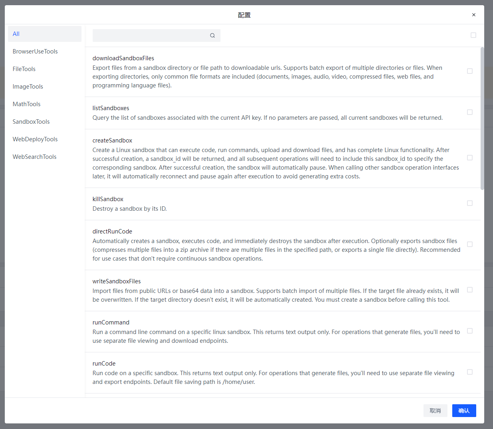
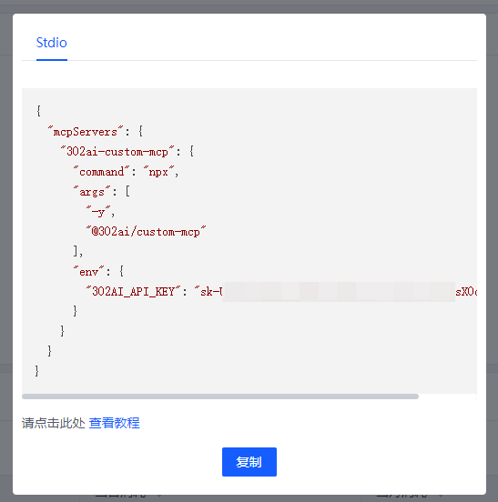
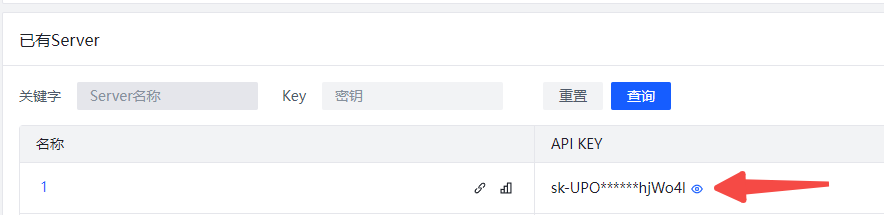
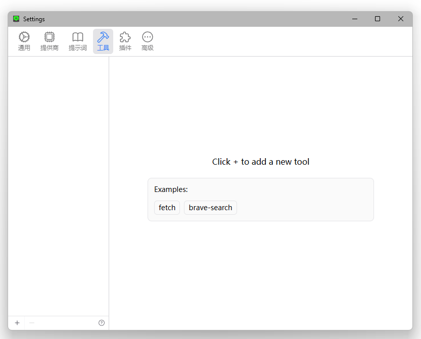

# <p align="center">🤖 302 AIカスタムMCPサービス🚀✨</p>

<p align="center">ツール選択をサポートし、柔軟な設定が可能なカスタマイズ可能なMCPサービスで、さまざまなニーズに対応します。</p>

<p align="center"><a href="https://www.npmjs.com/package/@302ai/custom-mcp" target="blank"></a></p >

<p align="center"><a href="README_zh.md">中文</a> | <a href="README.md">English</a> | <a href="README_ja.md">日本語</a></p>

 

## チュートリアル
メニューからMCP Serverを開きます   
     

名前を入力し、設定したいツールを選択します。   


これは現在利用可能なツールのリストで、継続的に更新されています   


作成後、Server名をクリックしてServer設定を表示できます   


異なるServerは異なるKEYを使用してツール設定を取得します。クライアントは一度インストールするだけで、再インストールの必要はありません。異なるServerに切り替えるには、API_KEYを変更するだけです。    


チャットボットのMCP Serverボタンを開きます   


302ai-custom-serverで先ほど作成したキーを入力します    


Serverスイッチをオンにすると使用できます。  

サードパーティクライアントでの使用例としてChatwiseを見てみましょう
Server名をクリックし、コピーボタンをクリックします    


Chatwiseの設定-ツールを開き、左下をクリックし、クリップボードからJSONをインポートします   


MCP Serverのインポートが成功し、これで通常通り使用できます。

## ✨ 機能特性 ✨
- 🔧 異なるAPIを選択することで、独自のMCP Serverを素早く生成
- 🌐 対応クライアント：302.AIのチャットボットを含む、MCPをサポートする各種クライアント
- 💻 現在、BrowserUseTools、FileTools、ImageTools、MathTools、SandboxToolsなど多数のツールタイプを含み、さらに更新予定

## 開発

依存関係のインストール:

```bash
npm install
```

サーバーのビルド:

```bash
npm run build
```

開発用の自動再ビルド:

```bash
npm run watch
```

## インストール

Claude Desktopで使用するには、サーバー設定を追加してください:

MacOS系统: `~/Library/Application Support/Claude/claude_desktop_config.json`    
Windows系统: `%APPDATA%/Claude/claude_desktop_config.json`

```json
{
  "mcpServers": {
    "302ai-custom-mcp": {
      "command": "npx",
      "args": ["-y", "@302ai/custom-mcp"],
      "env": {
        "302AI_API_KEY": "YOUR_API_KEY_HERE"
      }
    }
  }
}
```

Cherry Studioで使用するには、サーバー設定を追加してください:

```json
{
  "mcpServers": {
    "Li2ZXXJkvhAALyKOFeO4N": {
      "name": "302ai-custom-mcp",
      "description": "",
      "isActive": true,
      "registryUrl": "",
      "command": "npx",
      "args": [
        "-y",
        "@302ai/custom-mcp"
      ],
      "env": {
        "302AI_API_KEY": "YOUR_API_KEY_HERE"
      }
    }
  }
}
```

ChatWiseで使用するには、以下の内容をクリップボードにコピーしてください
```json
{
  "mcpServers": {
    "302ai-custom-mcp": {
      "command": "npx",
      "args": ["-y", "@302ai/custom-mcp"],
      "env": {
        "302AI_API_KEY": "YOUR_API_KEY_HERE"
      }
    }
  }
}
```

設定->ツール->追加ボタン->クリップボードからインポートを選択


### [ここ](https://dash.302.ai/apis/mcp-server)で302AI_API_KEYを取得してください
[使用チュートリアル](https://help.302.ai/docs/MCP-Server-de-shi-yong)

### デバッグ

MCPサーバーは標準入出力(stdio)を介して通信するため、デバッグが難しい場合があります。パッケージスクリプトとして利用可能な[MCP Inspector](https://github.com/modelcontextprotocol/inspector)の使用をお勧めします:

```bash
npm run inspector
```

InspectorはブラウザでデバッグツールにアクセスするためのURLを提供します。

## ✨ 302.AIについて ✨
[302.AI](https://302.ai/ja/)は企業向けのAIアプリケーションプラットフォームであり、必要に応じて支払い、すぐに使用できるオープンソースのエコシステムです。✨
1. 🧠 言語モデル、画像モデル、音声モデル、動画モデルなど、最新かつ包括的なAI機能とブランドを集約
2. 🚀 基本モデルの上に深層アプリケーション開発を行い、単なるチャットボットではなく、真のAI製品を開発
3. 💰 月額料金なし、すべての機能を従量課金制で提供し、参入障壁を低く、可能性を高く
4. 🛠 チームや中小企業向けの強力な管理バックエンド、一人で管理し、多人数で利用可能
5. 🔗 すべてのAI機能にAPIアクセスを提供し、すべてのツールをオープンソースでカスタマイズ可能（進行中）
6. 💡 強力な開発チームが週に2-3個の新アプリケーションをリリース、製品は毎日更新。開発者の参加も歓迎