# <p align="center">🤖 302AI 自定义 MCP 服务🚀✨</p>

<p align="center">一个支持自选工具，灵活配置的自定义MCP服务，满足您的不同需求。</p>

<p align="center"><a href="https://www.npmjs.com/package/@302ai/custom-mcp" target="blank"></a></p >

<p align="center"><a href="README_zh.md">中文</a> | <a href="README.md">English</a> | <a href="README_ja.md">日本語</a></p>

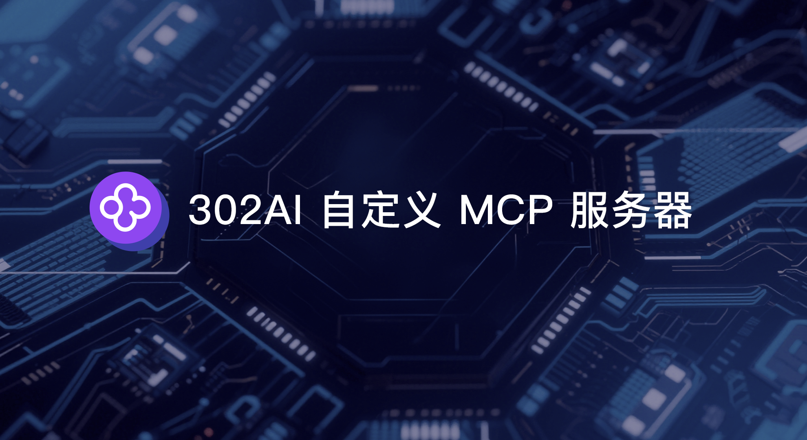 

## 使用教程
打开菜单中的MCP Server   
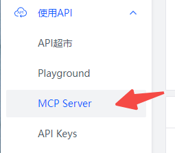     

填入名称，选择需要配置的工具。   
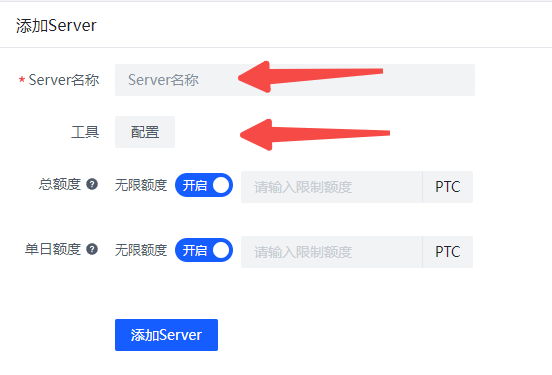

这是目前已有的工具列表，工具不断更新中   
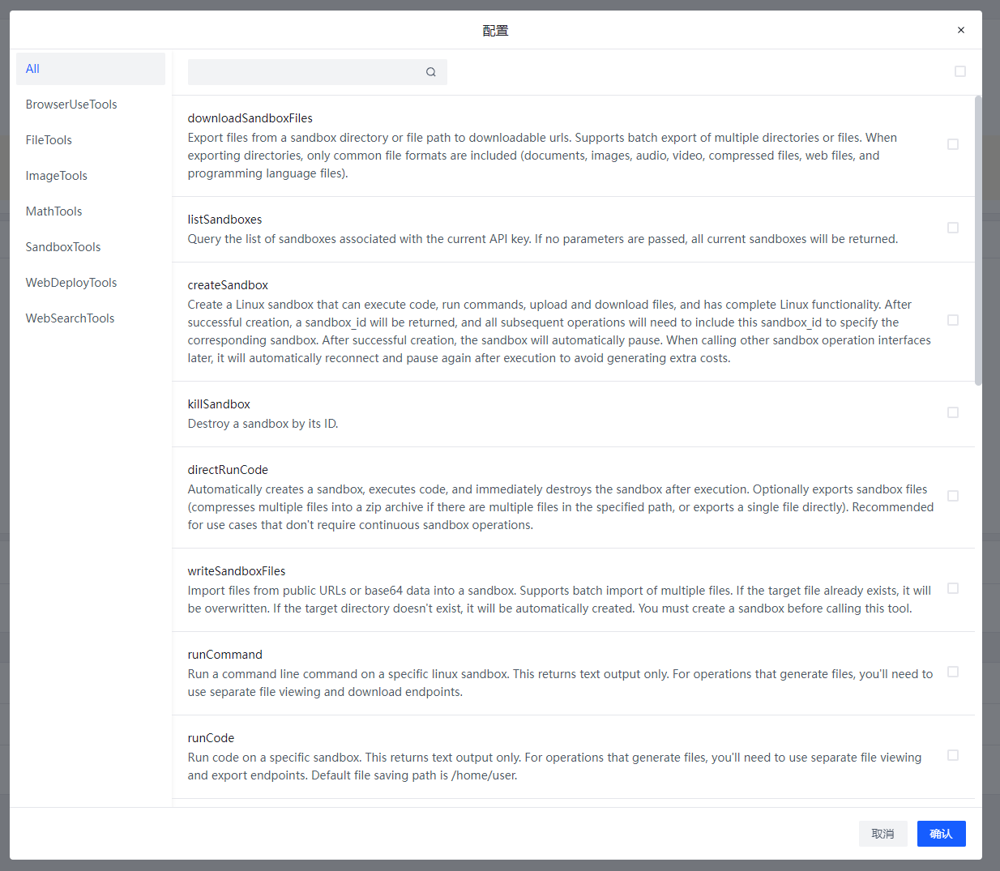

创建完可点击Server名称查看Server配置   
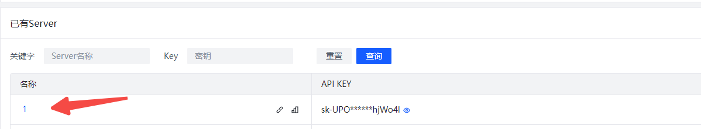

不同的Server根据不同的KEY来获取工具配置，客户端只需安装一次，无需重复安装。切换不同的Server只需要更改不同的API_KEY即可。    
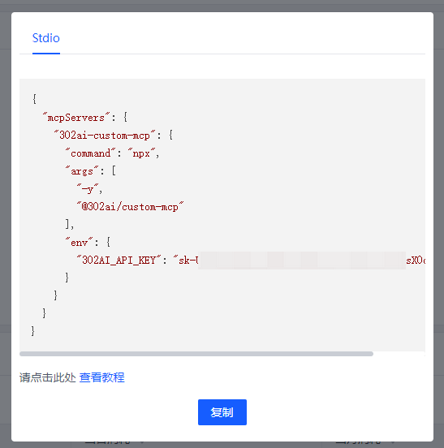

打开聊天机器人的MCP Server按钮   
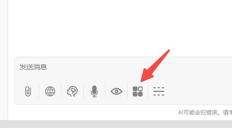

在302ai-custom-server中输入刚才创建的key    
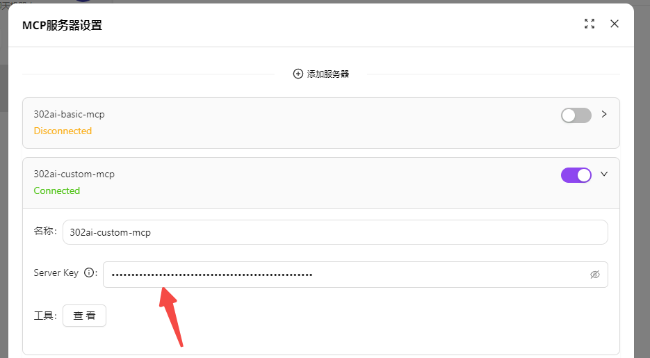
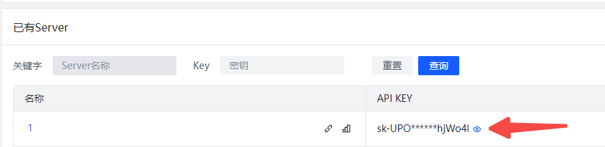
打开Server开关，即可使用。  

以Chatwise为例，在第三方客户端中使用
点击Server名称，点击复制按钮    
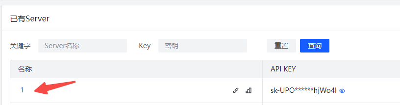


打开Chatwise的设置-工具，点击左下角，从剪切板导入JSON   
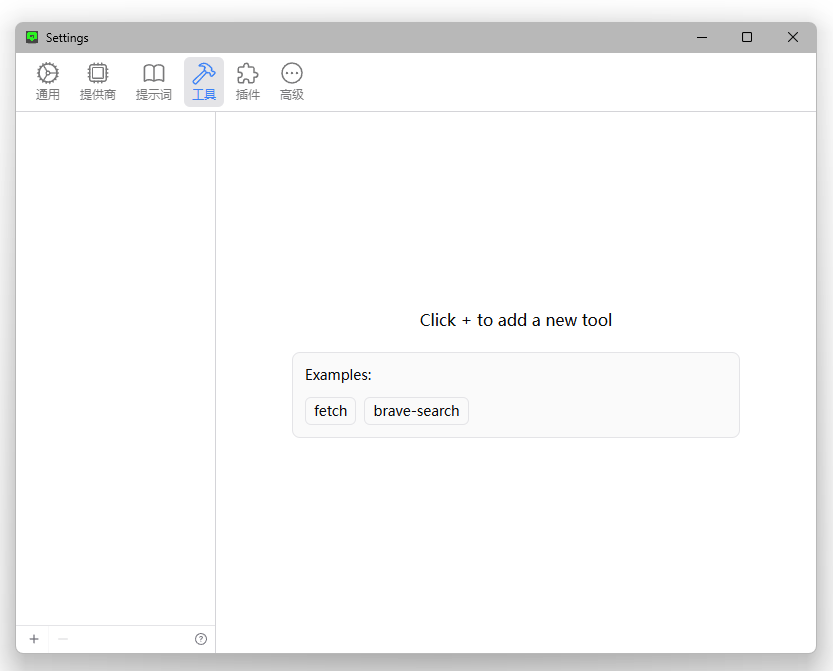
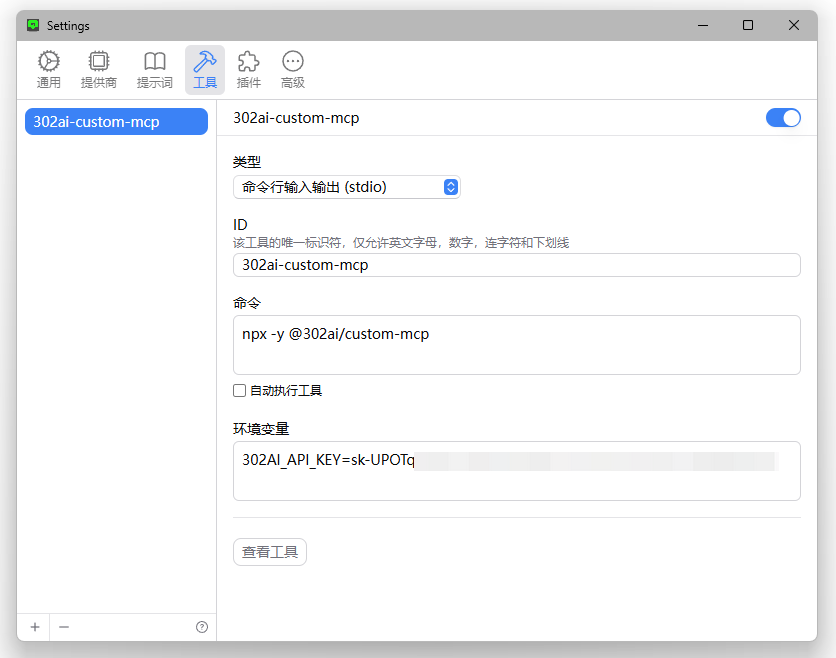
MCP Server导入成功，接下来正常使用即可。

## ✨ 功能特性 ✨
- 🔧 通过选择不同的API，快速生成属于自己的MCP Server
- 🌐 适用于：各类支持MCP的客户端，包括302.AI的聊天机器人
- 💻 当前已有BrowserUseTools、FileTools、ImageTools、MathTools、SandboxTools等多类工具，后续会不断更新

## 开发

安装依赖:

```bash
npm install
```

构建服务器:

```bash
npm run build
```

用于开发的自动重新构建:

```bash
npm run watch
```

## 安装

要与 Claude Desktop 一起使用，请添加服务器配置:

MacOS系统: `~/Library/Application Support/Claude/claude_desktop_config.json`    
Windows系统: `%APPDATA%/Claude/claude_desktop_config.json`

```json
{
  "mcpServers": {
    "302ai-custom-mcp": {
      "command": "npx",
      "args": ["-y", "@302ai/custom-mcp"],
      "env": {
        "302AI_API_KEY": "YOUR_API_KEY_HERE"
      }
    }
  }
}
```

要与 Cherry Studio 一起使用，请添加服务器配置:

```json
{
  "mcpServers": {
    "Li2ZXXJkvhAALyKOFeO4N": {
      "name": "302ai-custom-mcp",
      "description": "",
      "isActive": true,
      "registryUrl": "",
      "command": "npx",
      "args": [
        "-y",
        "@302ai/custom-mcp"
      ],
      "env": {
        "302AI_API_KEY": "YOUR_API_KEY_HERE"
      }
    }
  }
}
```

要与 ChatWise 一起使用，需将以下内容复制到剪切板
```json
{
  "mcpServers": {
    "302ai-custom-mcp": {
      "command": "npx",
      "args": ["-y", "@302ai/custom-mcp"],
      "env": {
        "302AI_API_KEY": "YOUR_API_KEY_HERE"
      }
    }
  }
}
```

在设置->工具->添加按钮->选择从剪贴板导入
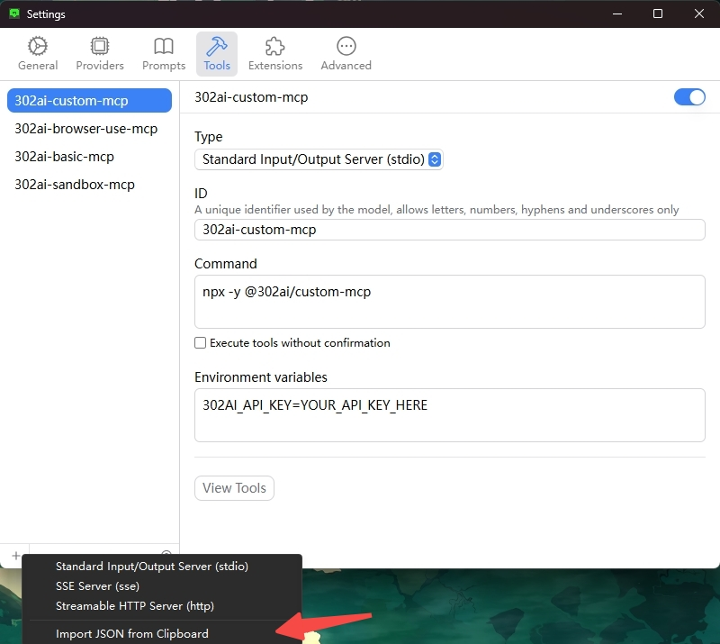

### 在[这里](https://dash.302.ai/apis/mcp-server)获取您的302AI_API_KEY
[使用教程](https://help.302.ai/docs/MCP-Server-de-shi-yong)

### 调试

由于 MCP 服务器通过标准输入输出(stdio)通信,调试可能具有挑战性。我们建议使用[MCP Inspector](https://github.com/modelcontextprotocol/inspector),它可以作为一个包脚本使用:

```bash
npm run inspector
```

Inspector 将提供一个 URL 以便在浏览器中访问调试工具。

## ✨ 302.AI介绍 ✨
[302.AI](https://302.ai)是一个面向企业的AI应用平台，按需付费，开箱即用，开源生态。✨
1. 🧠 集合了最新最全的AI能力和品牌，包括但不限于语言模型、图像模型、声音模型、视频模型。
2. 🚀 在基础模型上进行深度应用开发，我们开发真正的AI产品，而不是简单的对话机器人
3. 💰 零月费，所有功能按需付费，全面开放，做到真正的门槛低，上限高。
4. 🛠 功能强大的管理后台，面向团队和中小企业，一人管理，多人使用。
5. 🔗 所有AI能力均提供API接入，所有工具开源可自行定制（进行中）。
6. 💡 强大的开发团队，每周推出2-3个新应用，产品每日更新。有兴趣加入的开发者也欢迎联系我们